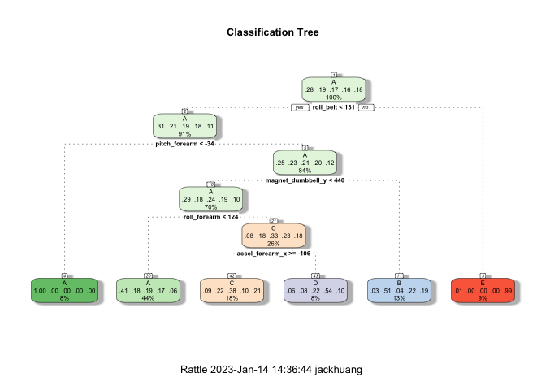
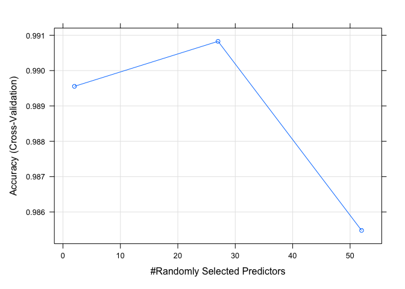
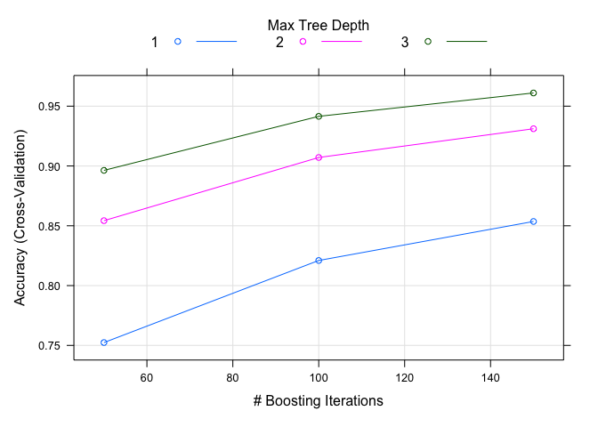

## Introduction

The goal of this project is to use data from accelerometers to predict the manner in which participants did a number of exercises. This report will describe how I built the model and what I think the expected out of sample error is. Decisions will be justified and the prediction model will be used to predict 20 different test cases. Any R code will be provided in the appendix section along with any plots generated.

## Background

Using devices such as Jawbone Up, Nike FuelBand, and Fitbit it is now possible to collect a large amount of data about personal activity relatively inexpensively. These type of devices are part of the quantified self movement – a group of enthusiasts who take measurements about themselves regularly to improve their health, to find patterns in their behavior, or because they are tech geeks. One thing that people regularly do is quantify how much of a particular activity they do, but they rarely quantify how well they do it. In this project, your goal will be to use data from accelerometers on the belt, forearm, arm, and dumbbell of 6 participants. They were asked to perform barbell lifts correctly and incorrectly in 5 different ways. More information is available from the website [here](http://web.archive.org/web/20161224072740/http:/groupware.les.inf.puc-rio.br/har (see the section on the Weight Lifting Exercise Dataset)).


### Data

The training data for this project are available [here](https://d396qusza40orc.cloudfront.net/predmachlearn/pml-training.csv)

The test data are available [here](https://d396qusza40orc.cloudfront.net/predmachlearn/pml-testing.csv)


The data for this project come from this [source](http://web.archive.org/web/20161224072740/http:/groupware.les.inf.puc-rio.br/har). 

Velloso, E.; Bulling, A.; Gellersen, H.; Ugulino, W.; Fuks, H. **Qualitative Activity Recognition of Weight Lifting Exercises.** Proceedings of 4th International Conference in Cooperation with SIGCHI (Augmented Human ’13)”. Stuttgart, Germany: ACM SIGCHI, 2013.


## Data Pre-Processing

### Package Install

First, we load the necessary packages to conduct analysis and build the model.


```
## Loading required package: ggplot2
```

```
## Loading required package: lattice
```

```
## 
## Attaching package: 'dplyr'
```

```
## The following objects are masked from 'package:stats':
## 
##     filter, lag
```

```
## The following objects are masked from 'package:base':
## 
##     intersect, setdiff, setequal, union
```

```
## randomForest 4.7-1.1
```

```
## Type rfNews() to see new features/changes/bug fixes.
```

```
## 
## Attaching package: 'randomForest'
```

```
## The following object is masked from 'package:dplyr':
## 
##     combine
```

```
## The following object is masked from 'package:ggplot2':
## 
##     margin
```

```
## Loading required package: tibble
```

```
## Loading required package: bitops
```

```
## Rattle: A free graphical interface for data science with R.
## Version 5.5.1 Copyright (c) 2006-2021 Togaware Pty Ltd.
## Type 'rattle()' to shake, rattle, and roll your data.
```

```
## 
## Attaching package: 'rattle'
```

```
## The following object is masked from 'package:randomForest':
## 
##     importance
```

### Loading the Data

Next, we load the data from the data source.

1. pml-training.csv (our training dataset)
2. pml-testing.csv (our testing dataset)


### Data Partitioning

Before performing any data processing, we will split the training data into train and test sets. 


The training set has 11776 observations and while the testing set has 7846 observations.

### Data Cleansing

Before we move onto building the model, we will perform some data transformation on the testing, training and test data sets.

#### Removing Zero Covariates

In order to clean the data, first we will remove the following columns as they do not show any variance. 


```
##  [1] "new_window"              "kurtosis_roll_belt"     
##  [3] "kurtosis_picth_belt"     "kurtosis_yaw_belt"      
##  [5] "skewness_roll_belt"      "skewness_roll_belt.1"   
##  [7] "skewness_yaw_belt"       "max_yaw_belt"           
##  [9] "min_yaw_belt"            "amplitude_yaw_belt"     
## [11] "avg_roll_arm"            "stddev_roll_arm"        
## [13] "var_roll_arm"            "avg_pitch_arm"          
## [15] "stddev_pitch_arm"        "var_pitch_arm"          
## [17] "avg_yaw_arm"             "stddev_yaw_arm"         
## [19] "var_yaw_arm"             "kurtosis_roll_arm"      
## [21] "kurtosis_picth_arm"      "kurtosis_yaw_arm"       
## [23] "skewness_roll_arm"       "skewness_pitch_arm"     
## [25] "skewness_yaw_arm"        "max_roll_arm"           
## [27] "amplitude_roll_arm"      "kurtosis_roll_dumbbell" 
## [29] "kurtosis_picth_dumbbell" "kurtosis_yaw_dumbbell"  
## [31] "skewness_roll_dumbbell"  "skewness_pitch_dumbbell"
## [33] "skewness_yaw_dumbbell"   "max_yaw_dumbbell"       
## [35] "min_yaw_dumbbell"        "amplitude_yaw_dumbbell" 
## [37] "kurtosis_roll_forearm"   "kurtosis_picth_forearm" 
## [39] "kurtosis_yaw_forearm"    "skewness_roll_forearm"  
## [41] "skewness_pitch_forearm"  "skewness_yaw_forearm"   
## [43] "max_roll_forearm"        "max_yaw_forearm"        
## [45] "min_roll_forearm"        "min_yaw_forearm"        
## [47] "amplitude_yaw_forearm"   "avg_roll_forearm"       
## [49] "stddev_roll_forearm"     "var_roll_forearm"       
## [51] "avg_pitch_forearm"       "stddev_pitch_forearm"   
## [53] "var_pitch_forearm"       "avg_yaw_forearm"        
## [55] "stddev_yaw_forearm"      "var_yaw_forearm"
```

#### Missing Values

Now, we will remove columns which have at least 90% missing values. 


```
##                    X            user_name raw_timestamp_part_1 
##                    0                    0                    0 
## raw_timestamp_part_2       cvtd_timestamp           num_window 
##                    0                    0                    0 
##            roll_belt           pitch_belt             yaw_belt 
##                    0                    0                    0 
##     total_accel_belt         gyros_belt_x         gyros_belt_y 
##                    0                    0                    0 
##         gyros_belt_z         accel_belt_x         accel_belt_y 
##                    0                    0                    0 
##         accel_belt_z        magnet_belt_x        magnet_belt_y 
##                    0                    0                    0 
##        magnet_belt_z             roll_arm            pitch_arm 
##                    0                    0                    0 
##              yaw_arm      total_accel_arm          gyros_arm_x 
##                    0                    0                    0 
##          gyros_arm_y          gyros_arm_z          accel_arm_x 
##                    0                    0                    0 
##          accel_arm_y          accel_arm_z         magnet_arm_x 
##                    0                    0                    0 
##         magnet_arm_y         magnet_arm_z        roll_dumbbell 
##                    0                    0                    0 
##       pitch_dumbbell         yaw_dumbbell total_accel_dumbbell 
##                    0                    0                    0 
##     gyros_dumbbell_x     gyros_dumbbell_y     gyros_dumbbell_z 
##                    0                    0                    0 
##     accel_dumbbell_x     accel_dumbbell_y     accel_dumbbell_z 
##                    0                    0                    0 
##    magnet_dumbbell_x    magnet_dumbbell_y    magnet_dumbbell_z 
##                    0                    0                    0 
##         roll_forearm        pitch_forearm          yaw_forearm 
##                    0                    0                    0 
##  total_accel_forearm      gyros_forearm_x      gyros_forearm_y 
##                    0                    0                    0 
##      gyros_forearm_z      accel_forearm_x      accel_forearm_y 
##                    0                    0                    0 
##      accel_forearm_z     magnet_forearm_x     magnet_forearm_y 
##                    0                    0                    0 
##     magnet_forearm_z               classe 
##                    0                    0
```

As there are no more missing values, we will not peform any imputation.

#### Removing ID Columns

Now, we will remove identifying columns and columns which will not be useful in predicting exercise manner.


```
## [1] "X"                    "user_name"            "raw_timestamp_part_1"
## [4] "raw_timestamp_part_2" "cvtd_timestamp"       "num_window"
```

#### Data Scaling

To reduce the effects of skewed data, we will standardise the numeric/integer columns. 


Predictor variables which have high correlations are listed below:


Converting the classe dependent variable into a factor column.


## Model Building

We will build models using different supervised machine learning algorithms and select the best model based on the stats generated from the associated confusion matrices.

To prevent overfitting with trees, we will perform cross-validation with ten folds when applicable. We chose ten to reduce the bias and get an accurate estimate of the error between the predicted and validation values.

### Decision Tree Model

A basic algorithm - start with all the variables of one big group. Then, find the first variable that best splits the outcomes into two homogenous groups. Continue to divide the groups until they are homogeneous enough or small enough that you need to stop.


```
## CART 
## 
## 11776 samples
##    52 predictor
##     5 classes: 'A', 'B', 'C', 'D', 'E' 
## 
## No pre-processing
## Resampling: Cross-Validated (10 fold) 
## Summary of sample sizes: 10598, 10598, 10600, 10598, 10598, 10598, ... 
## Resampling results:
## 
##   Accuracy   Kappa    
##   0.5330314  0.3910825
## 
## Tuning parameter 'cp' was held constant at a value of 0.03
```

```
## Confusion Matrix and Statistics
## 
##           Reference
## Prediction    A    B    C    D    E
##          A 2042  646  624  587  212
##          B   28  494   42  227  186
##          C  128  321  551  167  341
##          D   27   57  151  305   69
##          E    7    0    0    0  634
## 
## Overall Statistics
##                                                
##                Accuracy : 0.5131               
##                  95% CI : (0.502, 0.5242)      
##     No Information Rate : 0.2845               
##     P-Value [Acc > NIR] : < 0.00000000000000022
##                                                
##                   Kappa : 0.3641               
##                                                
##  Mcnemar's Test P-Value : < 0.00000000000000022
## 
## Statistics by Class:
## 
##                      Class: A Class: B Class: C Class: D Class: E
## Sensitivity            0.9149  0.32543  0.40278  0.23717  0.43967
## Specificity            0.6315  0.92367  0.85227  0.95366  0.99891
## Pos Pred Value         0.4967  0.50563  0.36538  0.50082  0.98908
## Neg Pred Value         0.9491  0.85092  0.87109  0.86445  0.88786
## Prevalence             0.2845  0.19347  0.17436  0.16391  0.18379
## Detection Rate         0.2603  0.06296  0.07023  0.03887  0.08081
## Detection Prevalence   0.5240  0.12452  0.19220  0.07762  0.08170
## Balanced Accuracy      0.7732  0.62455  0.62752  0.59541  0.71929
```

### Random Forest Model

Random forests are usually one of the top-performing algorithms in prediction contests - an extension to bagging for classification and regression trees. The basic idea is very similar to bagging because we bootstrap samples. We take a resample of our observed data and our training data set. Then, we rebuild classification or regression trees on each of these bootstrap samples.


```
## Random Forest 
## 
## 11776 samples
##    52 predictor
##     5 classes: 'A', 'B', 'C', 'D', 'E' 
## 
## No pre-processing
## Resampling: Cross-Validated (10 fold) 
## Summary of sample sizes: 10600, 10599, 10598, 10598, 10597, 10598, ... 
## Resampling results across tuning parameters:
## 
##   mtry  Accuracy   Kappa    
##    2    0.9895545  0.9867861
##   27    0.9908277  0.9883962
##   52    0.9854773  0.9816271
## 
## Accuracy was used to select the optimal model using the largest value.
## The final value used for the model was mtry = 27.
```

```
## Confusion Matrix and Statistics
## 
##           Reference
## Prediction    A    B    C    D    E
##          A 2229   29    0    1    0
##          B    3 1481   16    1    1
##          C    0    8 1350   18    2
##          D    0    0    2 1266    5
##          E    0    0    0    0 1434
## 
## Overall Statistics
##                                                
##                Accuracy : 0.989                
##                  95% CI : (0.9865, 0.9912)     
##     No Information Rate : 0.2845               
##     P-Value [Acc > NIR] : < 0.00000000000000022
##                                                
##                   Kappa : 0.9861               
##                                                
##  Mcnemar's Test P-Value : NA                   
## 
## Statistics by Class:
## 
##                      Class: A Class: B Class: C Class: D Class: E
## Sensitivity            0.9987   0.9756   0.9868   0.9844   0.9945
## Specificity            0.9947   0.9967   0.9957   0.9989   1.0000
## Pos Pred Value         0.9867   0.9860   0.9797   0.9945   1.0000
## Neg Pred Value         0.9995   0.9942   0.9972   0.9970   0.9988
## Prevalence             0.2845   0.1935   0.1744   0.1639   0.1838
## Detection Rate         0.2841   0.1888   0.1721   0.1614   0.1828
## Detection Prevalence   0.2879   0.1914   0.1756   0.1622   0.1828
## Balanced Accuracy      0.9967   0.9862   0.9913   0.9917   0.9972
```

### Gradient Boosted Tree Model

Boosting is one of the most accurate out-of-the-box classifiers that you can use. The basic idea is you take a large number of possibly weak predictors and weigh them in a way that takes advantage of their strengths and add them up.


```
## Stochastic Gradient Boosting 
## 
## 11776 samples
##    52 predictor
##     5 classes: 'A', 'B', 'C', 'D', 'E' 
## 
## No pre-processing
## Resampling: Cross-Validated (10 fold) 
## Summary of sample sizes: 10599, 10598, 10599, 10598, 10599, 10598, ... 
## Resampling results across tuning parameters:
## 
##   interaction.depth  n.trees  Accuracy   Kappa    
##   1                   50      0.7523793  0.6858994
##   1                  100      0.8209926  0.7733068
##   1                  150      0.8536007  0.8146821
##   2                   50      0.8542815  0.8153416
##   2                  100      0.9070999  0.8824296
##   2                  150      0.9311326  0.9128469
##   3                   50      0.8963149  0.8687016
##   3                  100      0.9414923  0.9259666
##   3                  150      0.9610233  0.9506873
## 
## Tuning parameter 'shrinkage' was held constant at a value of 0.1
## 
## Tuning parameter 'n.minobsinnode' was held constant at a value of 10
## Accuracy was used to select the optimal model using the largest value.
## The final values used for the model were n.trees = 150, interaction.depth =
##  3, shrinkage = 0.1 and n.minobsinnode = 10.
```

```
## Confusion Matrix and Statistics
## 
##           Reference
## Prediction    A    B    C    D    E
##          A 2191   51    0    1    1
##          B   32 1428   33    4   10
##          C    9   39 1318   39   12
##          D    0    0   14 1232   20
##          E    0    0    3   10 1399
## 
## Overall Statistics
##                                                
##                Accuracy : 0.9646               
##                  95% CI : (0.9602, 0.9685)     
##     No Information Rate : 0.2845               
##     P-Value [Acc > NIR] : < 0.00000000000000022
##                                                
##                   Kappa : 0.9552               
##                                                
##  Mcnemar's Test P-Value : 0.0000002277         
## 
## Statistics by Class:
## 
##                      Class: A Class: B Class: C Class: D Class: E
## Sensitivity            0.9816   0.9407   0.9635   0.9580   0.9702
## Specificity            0.9906   0.9875   0.9847   0.9948   0.9980
## Pos Pred Value         0.9764   0.9476   0.9301   0.9731   0.9908
## Neg Pred Value         0.9927   0.9858   0.9922   0.9918   0.9933
## Prevalence             0.2845   0.1935   0.1744   0.1639   0.1838
## Detection Rate         0.2793   0.1820   0.1680   0.1570   0.1783
## Detection Prevalence   0.2860   0.1921   0.1806   0.1614   0.1800
## Balanced Accuracy      0.9861   0.9641   0.9741   0.9764   0.9841
```

## Results

A summary of the modelling results is given below - ordered by descending accuracy.


```
##                         Accuracy Out of Sample Error
## Random Forest          0.9890390          0.01096100
## Gradient Boosted Trees 0.9645679          0.03543207
## Decision Tree          0.5131277          0.48687229
```

The best performing model based on accuracy (98.9039000764721%) and out of sample error (1.09609992352792%) is the Random Forest model.

## Predictions

Now we will apply our machine learning algorithm to the 20 test cases available in the test data.


```
##  [1] B A B A A E D B A A B C B A E E A B B B
## Levels: A B C D E
```

## Appendix

### A. R Code 


```r
knitr::opts_chunk$set(echo = FALSE,
                      fig.align = "center")

r = getOption("repos")
r["CRAN"] = "https://cran.curtin.edu.au/"
options(repos = r)
options(scipen = 999)
packages <- c("caret", "dplyr","randomForest", "rpart", "rattle")
installed_packages <- packages %in% rownames(installed.packages())

if(any(installed_packages == FALSE)) {
  install.packages(packages[!installed_packages], type = "source")
}

update.packages(packages)

invisible(lapply(packages, library, character.only=TRUE))
trainURL <- "https://d396qusza40orc.cloudfront.net/predmachlearn/pml-training.csv"

testURL <- "https://d396qusza40orc.cloudfront.net/predmachlearn/pml-testing.csv"

trainData <- "./Data/pml-training.csv"
testData <- "./Data/pml-testing.csv"

if (!file.exists("./Data")) {
  dir.create("./Data")
}

if (!file.exists(trainData)) {
  download.file(trainURL, destfile = trainData, method = "curl")
}

if (!file.exists(testData)) {
  download.file(testURL, destfile = testData, method = "curl")
}

training <- read.csv("Data/pml-training.csv")
testing <- read.csv("Data/pml-testing.csv")
set.seed(100)
trainIndex <- createDataPartition(training$classe, p = 0.60, list=FALSE)

train <- training[trainIndex,]; test <- training[-trainIndex,]
trainobs <- dim(train)[1]; testobs <- dim(test)[1]
names(train) -> coln
noVarIndex <- nearZeroVar(train, saveMetrics = FALSE)
coln[noVarIndex]

train.nzv <- train[,-noVarIndex]
test.nzv <- test[,-noVarIndex]
testing.nzv <- testing[,-noVarIndex]

names(train.nzv) -> coln
miscol <- sapply(train.nzv, function(x) sum(is.na(x))/length(x))
miscolnames <- coln[miscol > 0.9]

train.mc <- train.nzv[!miscol > 0.9] 
test.mc <- test.nzv[!miscol > 0.9]
testing.mc <- testing.nzv[!miscol > 0.9]

names(train.mc) -> coln

miscol2 <- sapply(train.mc, function(x) sum(is.na(x))/length(x))
miscol2
IDcol <- grep("X|user|timestamp|window",names(train.mc))
coln[IDcol]

train.id <- train.mc[,-IDcol] 
testing.id <- testing.mc[,-IDcol] 
test.id <- test.mc[,-IDcol] 
train.scaled <- train.id
for (i in 1:length(train.id)){
  if (class(train.id[,i]) == "numeric|integer"){
    train.scaled[,i] <- scale(train.id[,i])
  }
  else {
    train.scaled[,i] <- train.id[,i]
  }
}

test.scaled <- test.id
for (i in 1:length(test.id)){
  if (class(test.id[,i]) == "numeric|integer"){
    test.scaled[,i] <- scale(test.id[,i])
  }
  else {
    test.scaled[,i] <- test.id[,i]
  }
}

testing.scaled <- testing.id
for (i in 1:length(testing.id)){
  if (class(testing.id[,i]) == "numeric|integer"){
    testing.scaled[,i] <- scale(testing.id[,i])
  }
  else {
    testing.scaled[,i] <- testing.id[,i]
  }
}
#Predictor variables which have high correlations are listed below:
M <- abs(cor(train.scaled[-53]))
diag(M) <- 0
which(M > 0.8, arr.ind=T) 
train.scaled %>%
  mutate(classe = factor(classe)) -> train.scaled 

test.scaled %>%
  mutate(classe = factor(classe)) -> test.scaled 

testing.scaled %>%
  select(-problem_id) -> testing.scaled
control <- trainControl(method = "cv", number = 10)
modFitDT <- train(classe ~ ., data = train.scaled, method="rpart", trControl=control, tuneGrid = data.frame(cp=0.03)) 
## The complexity parameter (cp) in rpart is the min. improvement needed at each node of the model
modFitDT

predictionsDT <- predict(modFitDT, newdata = test.id)
cmDT <- confusionMatrix(predictionsDT, test.scaled$classe)
cmDT
control <- trainControl(method = "cv", number = 10)
modFitRF <- train(classe ~ ., data = train.scaled, method="rf", trControl=control)
modFitRF

predictionsRF <- predict(modFitRF, newdata = test.id)
cmRF <- confusionMatrix(predictionsRF, test.scaled$classe)
cmRF
control <- trainControl(method = "cv", number = 10)
modFitGB <- train(classe ~., data = train.scaled, method = "gbm", trControl = control, verbose = F)
modFitGB

predictionsGB <- predict(modFitGB, newdata = test.scaled)
cmGB <- confusionMatrix(predictionsGB, test.scaled$classe)
cmGB
accuracy <- rbind(cmDT$overall[1], cmRF$overall[1], cmGB$overall[1])

rownames(accuracy) <- c("Decision Tree", "Random Forest", "Gradient Boosted Trees")
accuracy %>% 
  as.data.frame() %>%
  mutate(`Out of Sample Error` = 1-Accuracy) %>%
  arrange(`Out of Sample Error`) -> results

results 
predictions <- predict(modFitRF, newdata = testing.scaled, type = "raw") 
predictions
fancyRpartPlot(modFitDT$finalModel, uniform = T, main = "Classification Tree")
plot(modFitRF)
plot(modFitGB)
```

### B. Decision Tree



### C. Random Forest Model Accuracy vs Randomly Selected Predictors



### D. Gradient Boosted Trees Model Accuracy vs Randomly Selected Predictors


